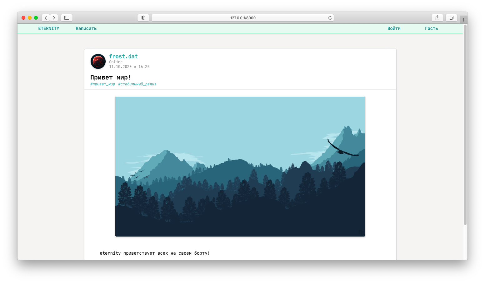

# eternity-django

# Развертывание
## Окружение docker

Для того чтобы развернуть приложение в окружении docker, используйте [Dockerfile](https://github.com/froOst23/eternity-django/blob/main/Dockerfile)

Для сборки приложения в окружении docker используется следующая команда:

<code>docker build -t <Название_контейрена>:<Тег> .</code>

Для запуска собранного контейнера используется следующая команда:

<code>docker run -d -p <Желаемый_порт>:8000 <Название_контейрена>:<Тег> 0.0.0.0:8000</code>, где:

* <code>0.0.0.0:8000</code> - передаваемый аргумент ip-адреса и используемого порта на вход приложения.

Для сборки и запуска приложения в окружении docker-compose используется слудующая команда, описанная в конфигурационном файле [docker-compose.yml](https://github.com/froOst23/eternity-django/blob/main/docker-compose.yml):

<code>docker-compose up</code>

## Окружение heroku

Для того чтобы развернуть приложение на хостинг [heroku](https://id.heroku.com/login) используется конфигурационный файл [Procfile](https://github.com/froOst23/eternity-django/blob/main/Procfile)

# Используемые модели
## Profile
### Описание модели

Модель <code>Profile</code> позиционирует себя как расширяющая модель для <code>User</code>, которая содержит в себе следующие поля:

* Поле <code>user</code> - предназначено для реализации расширения модели <code>User</code>

* Поле <code>bio</code> - содержит информацию о пользователе, его описание или боиграфию;

* Поле <code>photo</code> - содержит ссылку на фотографию профиля;

* Поле <code>created</code> - содержит информацию о дате регистрации пользователя на сайте;

* Поле <code>is_online</code> - содержит информацию, находится ли сейчас пользователь на сайте или нет.

Для расширения User было использована реализации связи один-к-одному. В нашем случае используется поле:

<code>user = models.OneToOneField(User, on_delete=models.CASCADE)</code>

Более подробная информация о стратегии расширения модели <code>User</code> находится на [Habr.com - Стратегии расширения Django User Model](https://habr.com/ru/post/313764/#OneToOneField).

### Одновременная запись в модель User и Profile (модель раширения возможностей User)

Для реализации данного функцонала была написала функция <code>update_profile</code> с декоратором <code>@transaction.atomic</code> с явным управлением транзакциями базы данных.

<code>@transaction.atomic</code> имеет атомарность, которая является основным свойством транзакций базы данных. 

<code>atomic</code> позволяет создать блок кода, для которого гарантируется атомарность операций над базой данных. Если этот блок кода выполнился без ошибок, все изменения фиксируются в базе данных. Если произошла ошибка, все изменений будут отменены.

Подробная информация содержится в [документации по django 1.9](https://djbook.ru/rel1.7/topics/db/transactions.html)

### Показ параметра пользователя - Online/Offline

Для реализации данного функционала было использован метод прослушивания сигналов (<code>user_logged_in</code>, <code>user_logged_out</code>), с помощью декортатора <code>@receiver</code> 

При получении сигнала об успешной авторизации или выхода из системы, расширенная модель <code>User</code> - <code>Profile</code> меняется дискретный сигнал, поле <code>is_online</code> в зависимости от сигнала.

Подробная информация содержится в [документации по django 1.9](https://djbook.ru/rel1.9/topics/signals.html)